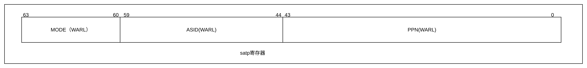
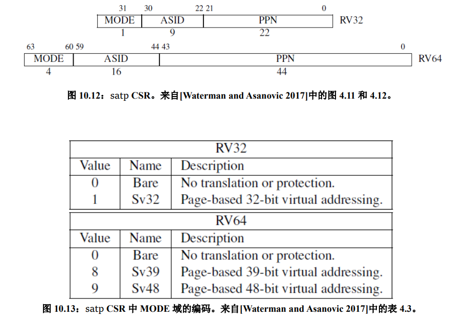
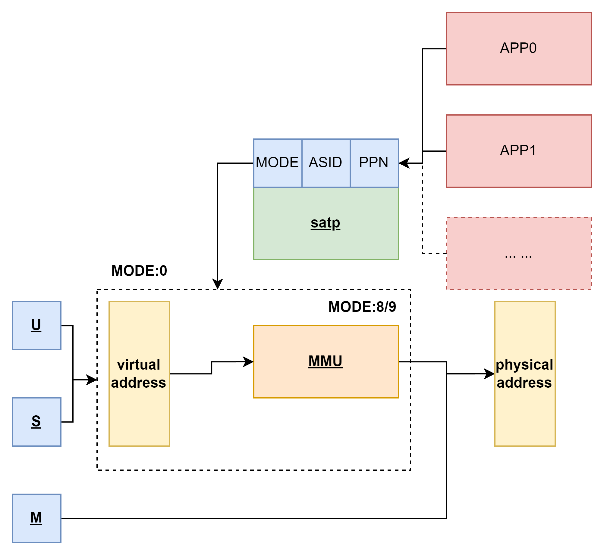
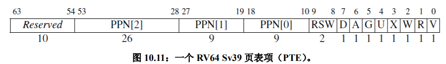

# 早期初始化页表

`setup_vm`是在内核启动阶段建立的临时，最小化的启动页表

``` c

```

首先目标是：
1. 开启分页模式：
2. 为内核自身提供映射：
3. 为必要的外设和数据提供映射：

##  映射内容

恒等映射 (Identity Mapping) 或 线性映射 (Linear Mapping) 

我们采用


## 分页机制选择

<!--  -->
CSR状态寄存器`satp`,在64位系统中,高4位,


MODE 
* 在MODE为0--- 的时候,所有的优先级的内存访问都是直接访问物理内存
* 在MODE设置为8--- 时,分页机制被开启,而且选用的是`SV39分页机制`,那么S/U级别的特权级访问的时候就需要通过MMU.**我们是使用这种分页机制**.
* 在MODE设置为9--- 时,分页机制被开启,而且选用的是`SV48分页机制`.

 ASID
* ASID 表示地址空间标识符

PPN
* PPN 存的是根页表所在的物理页号.这样, 给定一个虚拟页号,CPU 就可以从三级页表的根页表开始一步步的将其映射到一个物理页号。

真正要完成访存的时候`PPN`决定的根节点决定了我们当前不同APP同样的虚拟内存怎么映射到不同的物理内存的。




## 页表项结构

页表项

```c
//64位
typedef struct {
	unsigned long pte;
} pte_t;
```
`储存方式`是`偏移+页数`的方式.

V(Valid)：仅当位 V 为 1 时，页表项才是合法的；
R(Read)/W(Write)/X(eXecute)：分别控制索引到这个页表项的对应虚拟页面是否允许读/写/执行；
U(User)：控制索引到这个页表项的对应虚拟页面是否在 CPU 处于 U 特权级的情况下是否被允许访问；
G：暂且不理会；
A(Accessed)：处理器记录自从页表项上的这一位被清零之后，页表项的对应虚拟页面是否被访问过；
D(Dirty)：处理器记录自从页表项上的这一位被清零之后，页表项的对应虚拟页面是否被修改过。

* **PPN**与**PFN**
    PPN是页表项中的页表物理页帧号，PFN是物理页帧号。
    
    * PPN 指的是当前页表条目所指向的下一层页表的物理页帧号。
    
    * PFN 是 物理页帧号，表示实际映射的物理内存页的编号。每个 PFN 对应一个物理页。


## 页表每级结构

早期全局目录用一个数组存储`pgd_t`。
``` c
/* 每个页全局目录（PGD）包含的指针数量 */
#define PTRS_PER_PGD    (PAGE_SIZE / sizeof(pgd_t))  
/* 页全局目录*/
pgd_t early_pg_dir[PTRS_PER_PGD] __initdata __aligned(PAGE_SIZE);

```


