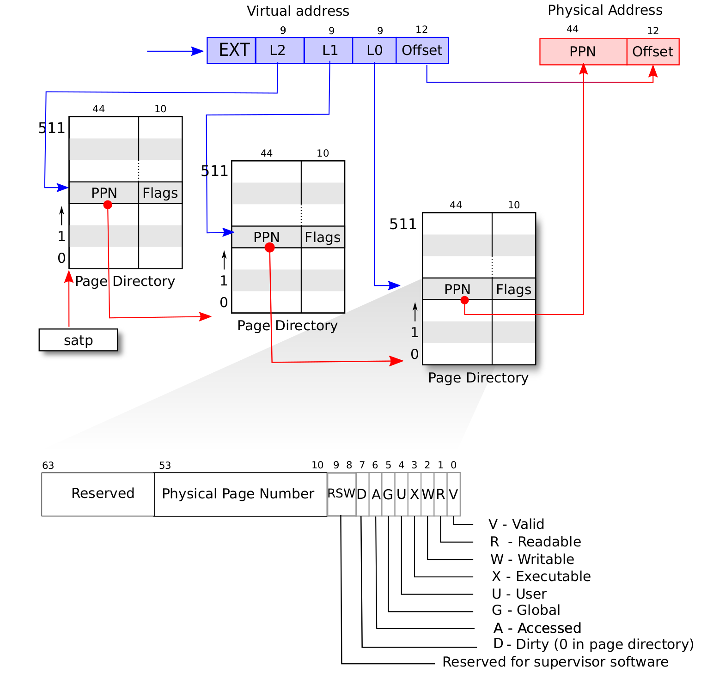

# 早期初始化页表

`setup_vm`是在内核启动阶段建立的临时，最小化的启动页表

``` c

```

首先目标是：
1. 开启分页模式：
2. 为内核自身提供映射     提供映射：

##  映射内容

恒等映射 (Identity Mapping) 或 线性映射 (Linear Mapping) 

我们采用


## 分页机制选择

<!--  -->
CSR状态寄存器`satp`,在64位系统中,高4位,


MODE 
* 在MODE为0--- 的时候,所有的优先级的内存访问都是直接访问物理内存
* 在MODE设置为8--- 时,分页机制被开启,而且选用的是`SV39分页机制`,那么S/U级别的特权级访问的时候就需要通过MMU.**我们是使用这种分页机制**.
* 在MODE设置为9--- 时,分页机制被开启,而且选用的是`SV48分页机制`.

 ASID
* ASID 表示地址空间标识符

PPN
* PPN 存的是根页表所在的物理页号.这样, 给定一个虚拟页号,CPU 就可以从三级页表的根页表开始一步步的将其映射到一个物理页号。

真正要完成访存的时候`PPN`决定的根节点决定了我们当前不同APP同样的虚拟内存怎么映射到不同的物理内存的。


## 页表项结构

页表项

```c
//64位
typedef struct {
	unsigned long pte;
} pte_t;
```
`储存方式`是`偏移+页数`的方式.

V(Valid)：仅当位 V 为 1 时，页表项才是合法的；
R(Read)/W(Write)/X(eXecute)：分别控制索引到这个页表项的对应虚拟页面是否允许读/写/执行；
U(User)：控制索引到这个页表项的对应虚拟页面是否在 CPU 处于 U 特权级的情况下是否被允许访问；
G：暂且不理会；
A(Accessed)：处理器记录自从页表项上的这一位被清零之后，页表项的对应虚拟页面是否被访问过；
D(Dirty)：处理器记录自从页表项上的这一位被清零之后，页表项的对应虚拟页面是否被修改过。

* **PPN**与**PFN**
    PPN是页表项中的页表物理页帧号，PFN是物理页帧号。
    
    * PPN 指的是当前页表条目所指向的下一层页表的物理页帧号。
    
    * PFN 是 物理页帧号，表示实际映射的物理内存页的编号。每个 PFN 对应一个物理页。


## 页表每级结构

早期全局目录用一个数组存储`pgd_t`。
``` c
/* 每个页全局目录（PGD）包含的指针数量 */
#define PTRS_PER_PGD    (PAGE_SIZE / sizeof(pgd_t))  
/* 页全局目录*/
pgd_t early_pg_dir[PTRS_PER_PGD] __initdata __aligned(PAGE_SIZE);

```
## kernel_mapping 结构体

用来描述内核代码和内核映射区之间各种偏移和基地址， 在early boot阶段用来完成内核页表映射（create_pgd_mapping 之类的函数会用到它）。

```c
struct kernel_mapping {
	unsigned long page_offset;
	unsigned long virt_addr;
	unsigned long virt_offset;
	uintptr_t phys_addr;
	uintptr_t size;
	/* Offset between linear mapping virtual address and kernel load address */
	unsigned long va_pa_offset;
	/* Offset between kernel mapping virtual address and kernel load address */
	unsigned long va_kernel_pa_offset;
	unsigned long va_kernel_xip_pa_offset;
#ifdef CONFIG_XIP_KERNEL
	uintptr_t xiprom;
	uintptr_t xiprom_sz;
#endif
};
```


* **线性映射区**（Linear Mapping）：物理内存直接映射到一个虚拟地址区域；

* **内核映射区**（Kernel Mapping）：ELF 格式的内核镜像加载地址；

* **XIP**（Execute In Place）：某些平台上支持直接在 ROM 或 Flash 中执行内核代码，不拷贝到 RAM，这时候有额外的偏移量。


## 操作结构体
```c
struct pt_alloc_ops {
	pte_t *(*get_pte_virt)(phys_addr_t pa);
	phys_addr_t (*alloc_pte)(uintptr_t va);
	#ifndef __PAGETABLE_PMD_FOLDED
	pmd_t *(*get_pmd_virt)(phys_addr_t pa);
	phys_addr_t (*alloc_pmd)(uintptr_t va);
	// pud_t *(*get_pud_virt)(phys_addr_t pa);
	// phys_addr_t (*alloc_pud)(uintptr_t va);
	// p4d_t *(*get_p4d_virt)(phys_addr_t pa);
	// phys_addr_t (*alloc_p4d)(uintptr_t va);
#endif
};	
```


## 建立映射函数 create_pgd_mapping


```c
void __init create_pgd_mapping(pgd_t *pgdp,
				      uintptr_t va, phys_addr_t pa,
				      phys_addr_t sz, pgprot_t prot)
{
	pgd_next_t *nextp;
	phys_addr_t next_phys;
	uintptr_t pgd_idx = pgd_index(va);
    //大页映射  不再往下分配二级页表
	if (sz == PGDIR_SIZE) {
		if (pgd_val(pgdp[pgd_idx]) == 0)
            //把物理页号 + 权限打包成一个合法的 PGD 项。
			pgdp[pgd_idx] = pfn_pgd(PFN_DOWN(pa), prot);
		return;
	}
    //
	if (pgd_val(pgdp[pgd_idx]) == 0) {
        // 分配页表项（PUD/PMD）
		next_phys = alloc_pgd_next(va);
		// pfn_pgd
        pgdp[pgd_idx] = pfn_pgd(PFN_DOWN(next_phys), PAGE_TABLE);
        // 获取用于写入二级页表物理
		nextp = get_pgd_next_virt(next_phys);
		memset(nextp, 0, PAGE_SIZE);
	} else {
        //如果分配页表项不为空，拿到页表物理地址
		next_phys = PFN_PHYS(_pgd_pfn(pgdp[pgd_idx]));
        // 虚拟地址
        nextp = get_pgd_next_virt(next_phys);
	}
    // 拿到
	create_pgd_next_mapping(nextp, va, pa, sz, prot);
}
```


* create_pgd_next_mapping 宏判断建立页表机制（看是有几级页表），发现下一步是建立p4d(5),pud(4),pmd(3)

``` c 
// 
#define create_pgd_next_mapping(__nextp, __va, __pa, __sz, __prot)	\
				(pgtable_l5_enabled ?			\
		create_p4d_mapping(__nextp, __va, __pa, __sz, __prot) : \
				(pgtable_l4_enabled ?			\
		create_pud_mapping((pud_t *)__nextp, __va, __pa, __sz, __prot) :	\
		create_pmd_mapping((pmd_t *)__nextp, __va, __pa, __sz, __prot)))

// 在Sv39模式下应该是 create_pud_mapping
```

转换虚拟地址 函数`get_pgd_next_virt`
```c
#define get_pgd_next_virt(__pa)	pt_ops.get_cpte_virt(__pa)
```

