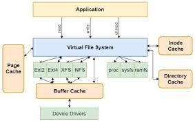
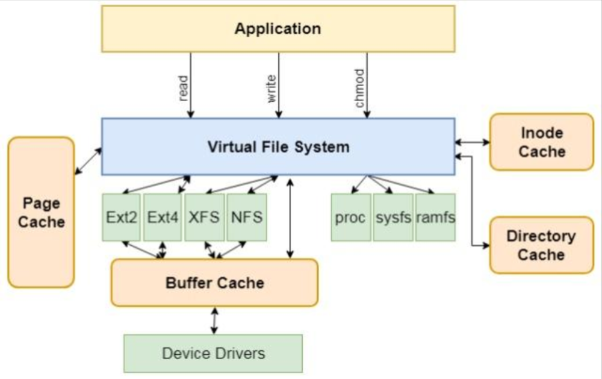

# vfs 简介

    虚拟文件系统（Virtual File System，简称VFS）是Linux内核中的一个核心组件，它为用户空间程序提供了一个统一的文件访问接口，使得程序可以不关心底层文件系统的具体实现，从而实现跨文件系统的操作。

    VFS通过定义一组通用的文件操作接口，如open()、read()、write()等，以及一组通用的文件数据结构，如inode、dentry、file等，为用户空间程序提供了一个统一的文件访问接口，而无须考虑具体的文件系统和实际的存储介质。。VFS还提供了一些辅助功能，如文件锁定、文件系统挂载/卸载、文件系统热插拔等。

# vfs 主要对象

虚拟文件系统（VFS）支持的文件系统可以分成主要三种类型

- 基于磁盘（disk-based）的文件系统
  管理本地磁盘和模拟磁盘的设备，基于磁盘的文件系统有：
  - Linux 的 Ext2、Ext3 和 ReiserFS
  - Unix 文件系统的变种，如 sysv、UFS、MINIX 和 VERITAS VxFS。
  - 微软的文件系统，如 MS-DOS、VFAT、NFTS
  - ISO9660 CD-ROM 文件系统和 UDF（Universal Disk Format）DVD 文件系统
  - 其他文件系统如 IBM OS/2 中的 HPFS、Apple’s Macintosh 的 HFS、AFFS 和 ADFS 等。
- 网络文件系统

  它允许方便访问网络上其他计算机的文件系统。VFS 支持的网络文件系统有 NFS、Coda、AFS（Andrew filesystem）、CIFS（Common Internet Filesystem）和 NCP（Novell’s NetWare Core Protocol）。

- 特殊文件系统

  它不管理磁盘空间。/proc 就是一个特殊的文件系统。

# vfs 组成部分

## 有四个主要对象类型：

    VFS主要由以下几个核心对象：超级块（superblock）、索引节点（inode）、目录项（dentry）和文件（file）。

### 超级块（由struct super_block表示）

超级块（spuerblock）对象由各自的文件系统实现，用来存储文件系统的信息。这个对象对应为文件系统超级块或者文件系统控制块，它存储在磁盘特定的扇区上。不是基于磁盘的文件系统（基于内存的虚拟文件系统，如 sysfs）临时生成超级块，并保存在内存中。

超级块对象由结构 struct super_block 表示，定义在 include/linux/fs.h 中。

创建、管理和销毁超级块对象的代码都在 fs/super.c 文件中。超级块对象通过 alloc_super（）函数创建并初始化。在文件系统安装时，内核会调用该函数以便从磁盘读取文件系统超级块。

-  super_operations超级块方法
``` c
struct super_operations {
    struct inode *(*alloc_inode)(struct super_block *sb); // alloc_inode ,分配struct inode,且初始化 ,传一个super_block 
    void (*destroy_inode)(struct inode *);  // destroy_inode  释放inode 资源
    void (*dirty_inode) (struct inode *);  // dirty_inode dirty的时候？？？？
    int (*write_inode) (struct inode *, int); // write_inode 把inode 写入磁盘
    void (*drop_inode) (struct inode *); //当最后一次对 inode 的访问被删除时调用，持有 inode_lock 自旋锁
    void (*delete_inode) (struct inode *); // 当 VFS 希望删除 inode 时调用。
    void (*put_super) (struct super_block *);  //put_super当 VFS 希望释放超级块（即卸载）时调用。此方法在持有超级块锁时调用。
    void (*write_super) (struct super_block *); //write_super当 VFS 超级块需要写入磁盘时调用。此方法是可选的。
    int (*sync_fs)(struct super_block *sb, int wait); //写出与超级块相关的所有脏数据时调用 （什么是脏数据）
    int (*freeze_fs) (struct super_block *); // 当 VFS 锁定文件系统并强制其进入一致状态时调用
    int (*unfreeze_fs) (struct super_block *); // unfreeze_fs：当 VFS 解锁文件系统并再次使其可写时调用
    int (*statfs) (struct dentry *, struct kstatfs *); // statfs：当 VFS 需要获取文件系统统计信息时调用。 
    int (*remount_fs) (struct super_block *, int *, char *); // 
    void (*clear_inode) (struct inode *); // 当 VFS 清除 inode 时调用
    void (*umount_begin) (struct super_block *); // 当 VFS 正在卸载文件系统时调用。
    int (*show_options)(struct seq_file *, struct vfsmount *); //由 VFS 调用以显示 /proc/<pid>/mounts 的挂载选项（见“挂载选项”部分）。
    ssize_t (*quota_read)(struct super_block *, int, char *, size_t, loff_t); // 由 VFS 调用以从文件系统配额文件中读取数据。
    ssize_t (*quota_write)(struct super_block *, int, const char *, size_t, loff_t); // VFS 调用以向文件系统配额文件中写入数据。

};
```

### 索引节点(由struct inode表示)

索引节点对象包含了内核在操作文件或目录时需要的全部信息。对于 Unix 文件系统来说，这些信息可以从磁盘索引节点直接读入。如果一个文件系统没有索引节点，那么，不管这些相关信息在磁盘上是怎么存放的，文件系统都必须从中提取这些信息。

索引节点对象由 inode 结构体表示，定义在文件 include/linux/fs.h。

一个索引节点代表文件系统中的一个文件，它也可以是设备或管道这样的特殊文件。因此索引节点结构体中有一些和特殊文件相关的项，比如 i_pipe 项就指向一个代表命名管道的数据结构。如果索引节点并非代表一个命名管道，那么该项就被简单地设置为 NULL。和特殊文件相关的项还有 i_devices、i_bdev 和 i_cdev 等。


### 目录项(由struct dentry 表示)

VFS 把目录当作文件对待，所以在路径/bin/ls，bin 和 ls 都属于文件-bin 是特殊的目录文
件，而 ls 是一个普通文件，路径中的每个组成部分都由一个索引节点对象表示。虽然它们可
以统一由索引节点表示，但 VFS 经常需要执行目录相关的操作，比如路径名查找等。路径名
超找需要解析路径中的每一个组成部分，不但要确定它有效，而且还需要进一步寻找路径中
的下一个部分。因此，VFS 引入了目录项对象，目录项对象由 dentry 结构体表示，定义在文件 include/linux/dcache.h 中。

- 目录项状态（三种） - 被使用

          一个被使用的目录项对应一个有效的索引节点（即d_inode指向相应的索引节点），并且表明该对象存在一个或多个使用者（即d_count为正值）。一个目录项处于被使用状态，意味着它正被VFS使用并且指向有效的索引节点，因此不能被丢弃。

      - 被等待

          一个未被使用的目录项对应一个有效的索引节点（d_inode指向一个索引节点），但是应指明VFS当前并未使用它（d_count为0）。该目录项对象仍然指向一个有效对象，而且

  被保留在缓存中以便需要时再使用它。由于该目录项不会过早地被销毁，所以在以后再需要
  使用它时，不必重新创建，从而使路径查找更迅速。但如果要回收内存的话，可以销毁未使
  用的目录项。

      - 未使用

          一个负状态的目录项没有对用的有效索引节点（d_inode为NULL），因为索引节点已

  被删除，或路径不再正确，但是目录项仍然保留，以便快速解析以后的路径查询。虽然负状
  态的目录项有些用处，但是如果需要的话，可以销毁它，因为毕竟在实际中很少用到它。目录项对象释放后也可以保存到 slab 对象缓存中去。

- 目录项缓存
  如果 VFS 层遍历路径名中所有的元素，并将它们逐个地解析成目录项对象，这是非常耗时的工作。所以内核将目录项对象缓存在目录项缓存（即 dcache）中。
  主要分为三部分：
  - “被使用”目录项链表
  - “最近被使用的”双向链表
  - 散列表和相应的散列函数用来快速将给定路径解析为相关目录项对象

- dentry对象
``` c
/* 目录项对象结构 */
struct dentry {
	/**
	 * 每个目录项对象都有3种状态：被使用，未使用和负状态
	 * 被使用：对应一个有效的索引节点（d_inode指向相应的索引节点），并且该对象由一个或多个使用者(d_count为正值)
	 * 未使用：对应一个有效的索引节点，但是VFS当前并没有使用这个目录项(d_count为0)
	 * 负状态：没有对应的有效索引节点（d_inode为NULL），因为索引节点被删除或者路径不存在了，但目录项仍然保留，以便快速解析以后的路径查询。
	 */
	// 目录项对象引用计数器  
	atomic_t d_count;		/* 使用计数 */
	unsigned int d_flags;		/* protected by d_lock */		/* 目录项标识 */
	spinlock_t d_lock;		/* per dentry lock */		/* 单目录项锁 */
	/* 表示dentry是否是一个挂载点，如果是挂载点，该成员不为0 */
	int d_mounted;		/* 是否是挂载点 */
	// inode节点的指针，便于快速找到对应的索引节点
	struct inode *d_inode;		/* Where the name belongs to - NULL is
					 * negative */		/* 相关联的索引节点 */
	/*
	 * The next three fields are touched by __d_lookup.  Place them here
	 * so they all fit in a cache line.
	 */
	/* 链接到dentry_hashtable的hash链表 */
	// dentry_hashtable哈希表维护在内存中的所有目录项，哈希表中每个元素都是一个双向循环链表，
	// 用于维护哈希值相等的目录项，这个双向循环链表是通过dentry中的d_hash成员来链接在一起的。
	// 利用d_lookup函数查找散列表，如果该函数在dcache中发现了匹配的目录项对象，则匹配对象被返回，
	// 否则，返回NULL指针。
	struct hlist_node d_hash;	/* lookup hash list */		/* 散列表 */
	/* 指向父dentry结构的指针 */  
	struct dentry *d_parent;	/* parent directory */		/* 父目录的目录项对象 */
	// 文件名  
	struct qstr d_name;		/* 目录项名称 */

	struct list_head d_lru;		/* LRU list */	/* 未使用的链表 */
	/*
	 * d_child and d_rcu can share memory
	 */
	union {
		struct list_head d_child;	/* child of parent list */	/* 目录项内部形成的链表 */
	 	struct rcu_head d_rcu;		/* RCU加锁 */
	} d_u;
	/* 是子项的链表头，子项可能是目录也可能是文件，所有子项都要链接到这个链表， */ 
	// 某目录的d_subdirs与该目录下所有文件的d_child成员一起形成一个双向循环链表，
	// 将该目录下的所有文件连接在一起，目的是保留文件的目录结构，即一个d_subdirs和
	// 多个d_child一起形成链表，d_subdirs对应文件在d_child对应文件的上一层目录。
	struct list_head d_subdirs;	/* our children */		/* 子目录链表 */
	// d_alias会插入到对应inode的i_dentry链表中
	struct list_head d_alias;	/* inode alias list */	/* 索引节点别名链表 */
	unsigned long d_time;		/* used by d_revalidate */	/* 重置时间 */
	// 指向dentry对应的操作函数集
	const struct dentry_operations *d_op;	/* 目录项操作相关函数 */
	// 指向对应超级块的指针
	struct super_block *d_sb;	/* The root of the dentry tree */	/* 文件的超级块 */
	void *d_fsdata;			/* fs-specific data */	/* 文件系统特有数据 */

	unsigned char d_iname[DNAME_INLINE_LEN_MIN];	/* small names */	/* 短文件名 */
};
```

### 文件对象（由struct file表示）

文件对象表示进程已打开的文件。文件对象是已打开的文件在内存中的表示。文件对象会首先进入我们的视野，进程直接处理的是文件，而不是超级块、索引节点或目录项。文件对象包含我们非常熟悉的信息（如访问模式、当前偏移等）。

该对象（不是物理文件）由相应的 open（）系统调用创建，由 close（）系统调用销毁，所有这些文件相关的调用实际上都是文件操作表中定义的方法。

## 与文件系统相关的数据结构

### file_system_type

  file_system_type 结构体定义在 include/linux/fs.h 中，用来描述一个具体的文件系统类型。该结构体定义了文件系统的名称、挂载函数、卸载函数、打开文件系统函数、释放超级块函数、统计信息函数、操作函数等信息。
- 
构描述文件系统。自内核 2.6.22 起，定义了以下成员：
``` c
struct file_system_type {
    const char *name;//文件系统类型的名称，如 "ext2"、"iso9660"、"msdos" 等。
    int fs_flags;//各种标志（例如 FS_REQUIRES_DEV、FS_NO_DCACHE 等）。
    int (*get_sb) (struct file_system_type *, int,
                   const char *, void *, struct vfsmount *);//当需要挂载此文件系统的新实例时调用的方法。
    void (*kill_sb) (struct super_block *); // 当需要卸载此文件系统的实例时调用的方法。
    struct module *owner;//用于内部 VFS 使用：在大多数情况下应将其初始化为 THIS_MODULE。
    struct file_system_type *next;//用于内部 VFS 使用：应将其初始化为 NULL。
    struct list_head fs_supers;
    //与锁依赖性相关的特定键。
    struct lock_class_key s_lock_key;
    struct lock_class_key s_umount_key;
};
```

- 注册和挂载文件系统
        
要注册和注销文件系统，可以使用以下 API 函数：
``` c
#include <linux/fs.h>

extern int register_filesystem(struct file_system_type *);
extern int unregister_filesystem(struct file_system_type *);
```

传递的 struct file_system_type 描述了您的文件系统。当请求将设备挂载到文件空间中的某个目录时，VFS 将调用特定文件系统的相应 get_sb() 方法。挂载点的 dentry 将更新为指向新文件系统的根 inode。

您可以在文件 /proc/filesystems 中查看所有注册到内核的文件系统。

### vfsmount

  当文件系统被实际安装时，将有一个 vfsmount 结构体在安装点被创建。该结构体用来
  代表文件系统的实例，即代表一个安装。vfsmount 结构被定义在 include/linux/mount.h 中。
- struct vfsmount
``` c
struct vfsmount {
	struct dentry *mnt_root;	/* root of the mounted tree */
	struct super_block *mnt_sb;	/* pointer to superblock */
	int mnt_flags;
	struct mnt_idmap *mnt_idmap;
} __randomize_layout;
```

## 和进程相关的数据结构
- fs_struct

和进程相关的第二个结构体是fs_struct。该结构由进程描述符的fs域指向。它包含文件系统和进程相关的信息，定义在文件include/linux/fs_struct.h中
```c
struct fs_struct {
    int users;
    rwlock_t lock;
    int umask;
    int in_exec;
    struct path root, pwd;
 };
```
- files_struct 

# vfs 工作原理

在用户程序的 write（f, &buf, len），向文件描述符为 f 的文件中，写入 len 个字节数据，待写入的数据存放在 buf 中。下图为 write（）将数据写入硬件上的简易流程。我们看到首先通过虚拟文件系统 VFS，然后根据不同文件系统的 write（）方法将数据写入物理设备上。

[write 流程](image.png)
